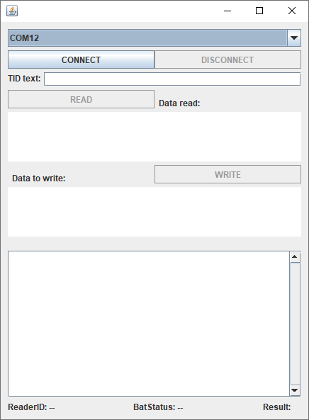

# samples-spc_unix / UNIX SPC sample codes
This sample code is for **SPC** communication (devices in SPC mode) on devices running an UNIX OS.

[Test LINK: SPC communication mode](../doc/communication-modes/spc)
//TODO Add link See "communication-modes/spc"

## Requirements
* Java IDE (For implementing this sample *eclipse IDE* was used)
* Micro-Sensys RFID reader with appropriate script running
* RFID transponders

> For compatible script files, check [Useful Links](#Useful-Links)

## Implementation
This code shows how to use **SpcInterfaceControl** class to communicate with a device running on SPC mode. 
Using this class the communication port can be open/closed. It automatically handles the data received and notifies the App using a Callback, and provides a function to send trigger commands to the script.

> Class information is available under API documentation. See [Useful Links](#Useful-Links)

## Steps
Import this project into your IDE and check the communication port name for the RFID reader (for example */dev/ttyUSB0*) and fill the name into the *JComboBox*.
Once the name is added to the code, start the debug/run session.

 1. Select the device you wish to connect to, and press CONNECT. Once the connect process finishes, the result will be shown in the EditText on the bottom side, and if the device is connected, the READ/WRITE buttons will be enabled.
 2. Received data will be automatically received on provided **SpcInterfaceCallback**
	"spcReaderHeartbeatReceived" will be called when Heartbeat is received
	"spcRawDataReceived" will be called when other data is received
 3. Use READ/WRITE buttons to trigger the processes built in the script

### Special Hints for Linux
* Device has to be configured in USB VCP mode (ask microsensys for HowTo)
	* To get VCP port name use:	
	> dmesg | grep FTDI
* To be able to communicate with RFID reader, the user must be part of the group "dialout".
	* To add the user to the group use:
	> sudo gpasswd --add [username] dialout

## Useful Links
 - [JAR Library und API documentation](https://www.microsensys.de/downloads/DevSamples/Libraries/UNIX/microsensysRFID%20-%20jar%20library/)
 - [Scripts](https://www.microsensys.de/downloads/DevSamples/Sample%20Codes/SPC/Additionals/Sample%20scripts/)
 - [iID® INTERFACE configuration tool (tool to upload script to reader)](https://www.microsensys.de/downloads/CDContent/Install/iID%c2%ae%20interface%20config%20tool.zip)

## Contact
* For coding questions or questions about this sample code, you can use [support@microsensys.de](mailto:support@microsensys.de)
* For general questions about the company or our devices, you can contact us using [info@microsensys.de](mailto:info@microsensys.de)

## Authors

* **Victor Garcia** - *Initial work* - [MICS-VGarcia](https://github.com/MICS-VGarcia/)
