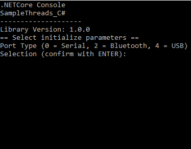

# .NET SPC sample code
This code shows how to use **SpcInterfaceControl** class to communicate with a device running on SPC mode. 
> For details on SPC communication check [Useful Links](#Useful-Links)

## Requirements
* IDE (for example Visual Studio)
* Micro-Sensys RFID reader with appropriate script running
* RFID transponders

> For compatible script files, check [Useful Links](#Useful-Links)

## Implementation
This code shows how to use **iIDReaderLibrary.SpcInterfaceControl** class to communicate with a device running on SPC mode. 
For demo purposes a .NET Core console is provided.
Code used for these projects is written in C# or VisualBasic

## Steps
Import the project into your IDE, chose a project and launch it. First in the console application you can select the communication port name for the RFID reader (for example */dev/ttyUSB0*). Then a sort of *menu* is shown to select the function to call

 1. Select the device parameters to use for *Initialize* (communication port type and name, and interface type). Once the initialization process finishes, the result will be shown including the Reader ID number.
 2. Received data will be automatically decoded as Heartbeat or other data
 3. Use READ/WRITE buttons to trigger the processes built in the script

## Useful Links
* [NuGet Package page](https://www.nuget.org/packages/Microsensys.iIDReaderLibrary.SpcInterfaceControl/)
* [API documentation](https://www.microsensys.de/downloads/DevSamples/Libraries/UNIX/iIDReaderLibrary%20-%20.NET%20library/)
* [Scripts](https://www.microsensys.de/downloads/DevSamples/Sample%20Codes/SPC/Additionals/Sample%20scripts/)
* [iID® INTERFACE configuration tool (tool to upload script to reader)](https://www.microsensys.de/downloads/SW_Install/iID%c2%aeinterface%20config%20tool/Setup%20iID%20interface%20config%20tool.exe)
* GitHub *documentation* repository: [Micro-Sensys/documentation](https://github.com/Micro-Sensys/documentation)
	* [communication-modes/spc](https://github.com/Micro-Sensys/documentation/tree/master/communication-modes/spc)

## Contact

* For coding questions or questions about this sample code, you can use [support@microsensys.de](mailto:support@microsensys.de)
* For general questions about the company or our devices, you can contact us using [info@microsensys.de](mailto:info@microsensys.de)

## Authors

* **Victor Garcia** - *Initial work* - [MICS-VGarcia](https://github.com/MICS-VGarcia/)
